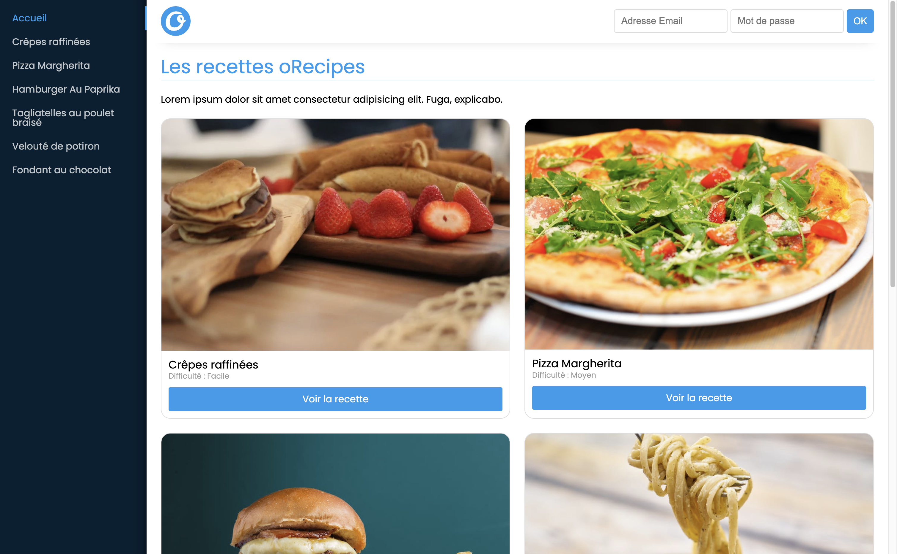

# oRecipes



**oRecipes** is a website project dedicated to culinary recipes. Powered by Express for the API, React and SCSS for the front-end to offer a user-friendly experience and connection management with JWT token.

### Step 1: Installing dependencies

Make sure you have Node.js and Yarn installed on your system.

In the API folder, run the following command to install the dependencies :

```
yarn install
```

In the Front folder, also run the following command to install the dependencies:

```
yarn install
```

### Step 2: Starting the API

1. Open a terminal window and navigate to the api folder.
2. Run the following command to start the API:

```
yarn start
```

### Step 3: Starting the front-end application

1. Open another terminal window and navigate to the front folder.
2. Run the following command to start the front application:

```
yarn start
```

### Step 4: Exploring the site

1. Open your browser and go to the URL <http://localhost:8080> (or another URL specified in your front-end application).
2. You can log in with one of the following three predefined users:

   - User 1 :

     Username: John

     Email: `bouclierman@herocorp.io`

     Password: `jennifer`

   - User 2:

   Username: Burt

   Email: `acidman@herocorp.io`

   Password: `fructis`

   - User 3:

   Username: Karin

   Email: `captain.sportsextremes@herocorp.io`

   Password: `pingpong`

3. Now you have access to a "Favourite recipes" tab in the menu, and on this page you'll find your favourite recipes
